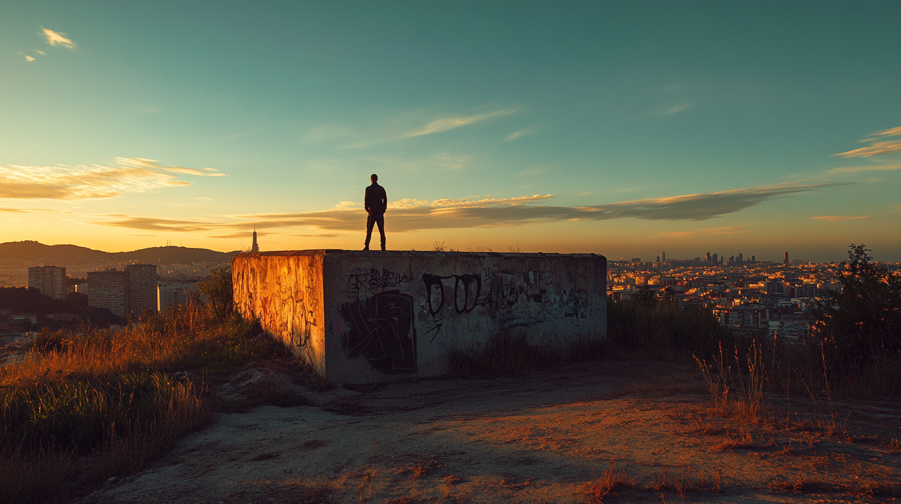

# ShutterScout.AI: Your AI-Powered Photography Location Scout



[](https://github.com/PatrickKalkman/shutterscout-ai/stargazers)
[](https://github.com/patrickkalkman/shutterscout-ai/graphs/contributors)
[](https://github.com/patrickkalkman/shutterscout-ai)
[](https://github.com/patrickkalkman/shutterscout-ai/issues)
[](https://makeapullrequest.com)
[](https://www.python.org/downloads/)

Looking for the perfect photo location? ShutterScout.AI combines real-time weather data, sun positions, and local knowledge to find your next perfect shot. No more hours of research – just instant, personalized location recommendations.

Read the full story behind ShutterScout.AI in my [Medium article](https://medium.com/@pkalkman).

## ✨ Key Features

- **Smart Location Discovery**: Finds hidden viewpoints and photo opportunities
- **Real-time Weather Integration**: Checks current conditions for optimal shooting
- **Golden Hour Calculations**: Precise timing for perfect lighting
- **Local Knowledge**: Learns from other photographers' experiences
- **Comprehensive Reports**: Detailed information about each location
- **Privacy Focused**: Your location data stays private
- **API Integration**: Uses Foursquare, Flickr, and weather APIs
- **Customizable**: Easy to extend with your own data sources

## 🏗️ Architecture

ShutterScout.AI uses SmolAgents framework with five main components:

1. **Location Service**: Determines your position using ipapi.co
2. **Astronomy Calculator**: Computes sun positions and golden hours
3. **Weather Service**: Real-time conditions via Tomorrow.io
4. **Places Discovery**: Finds locations through Foursquare
5. **Photo Analysis**: Gathers inspiration from Flickr

## 🚀 Getting Started

### Prerequisites

- Python 3.11 or higher
- API keys for:
  - Hugging Face
  - Foursquare
  - Flickr
  - Tomorrow.io
  - (Sunrise-sunset.org is free, no key needed)

### Installation

1. **Install UV** (if you haven't already):
```bash
curl -LsSf https://astral.sh/uv/install.sh | sh
```

2. **Clone & Navigate**:
```bash
git clone https://github.com/yourusername/shutterscout-ai
cd shutterscout-ai
```

3. **Set API Keys**:
```bash
export HUGGINGFACE_API_KEY='your-huggingface-key-here'
export FOURSQUARE_API_KEY='your-foursquare-key-here'
export FLICKR_API_KEY='your-flickr-key-here'
export TOMORROW_API_KEY='your-tomorrow-io-key-here'
```

### Usage Examples

```bash
# Get recommendations for your current location
uv run shutterscout.py

# Specify a different location
uv run shutterscout.py --location "Barcelona, Spain"

# Get recommendations for a specific date
uv run shutterscout.py --date "2024-03-15"

# Get detailed output with weather conditions
uv run shutterscout.py --verbose

# Specify a different search radius (in km)
uv run shutterscout.py --radius 20

# Save recommendations to a file
uv run shutterscout.py --output recommendations.md
```


## 🛠️ Extending ShutterScout.AI

Adding new data sources is straightforward with our tool system:

```python
@tool
def get_custom_data() -> dict:
    """
    Get custom photography location data.
    
    This tool allows integration of additional data sources for location
    discovery and analysis. The data will be combined with existing sources
    to provide more comprehensive recommendations.

    Returns:
        dict: Custom location data in a standardized format
    """
    # Your implementation here
    pass
```

## 🤝 Contributing

We welcome contributions! Here's how:

1. Fork the repository
2. Create your feature branch (`git checkout -b feature/AmazingFeature`)
3. Commit your changes (`git commit -m 'Add some AmazingFeature'`)
4. Push to the branch (`git push origin feature/AmazingFeature`)
5. Open a Pull Request

## 🔮 Future Plans

- Better location discovery through photography forums
- Crowd-sourced location database
- Smarter camera settings recommendations
- Community-driven improvements
- Enhanced technical evolution

## 📄 License

This project is licensed under the MIT License - see the [LICENSE](LICENSE) file for details.

## 🙏 Acknowledgments

- SmolAgents team for the framework
- Hugging Face for LLM support
- All the API providers (Foursquare, Flickr, Tomorrow.io)
- The photography community
- All our contributors and users!

---

Built with ❤️ by photographers, for photographers. Star us on GitHub if you find this useful!